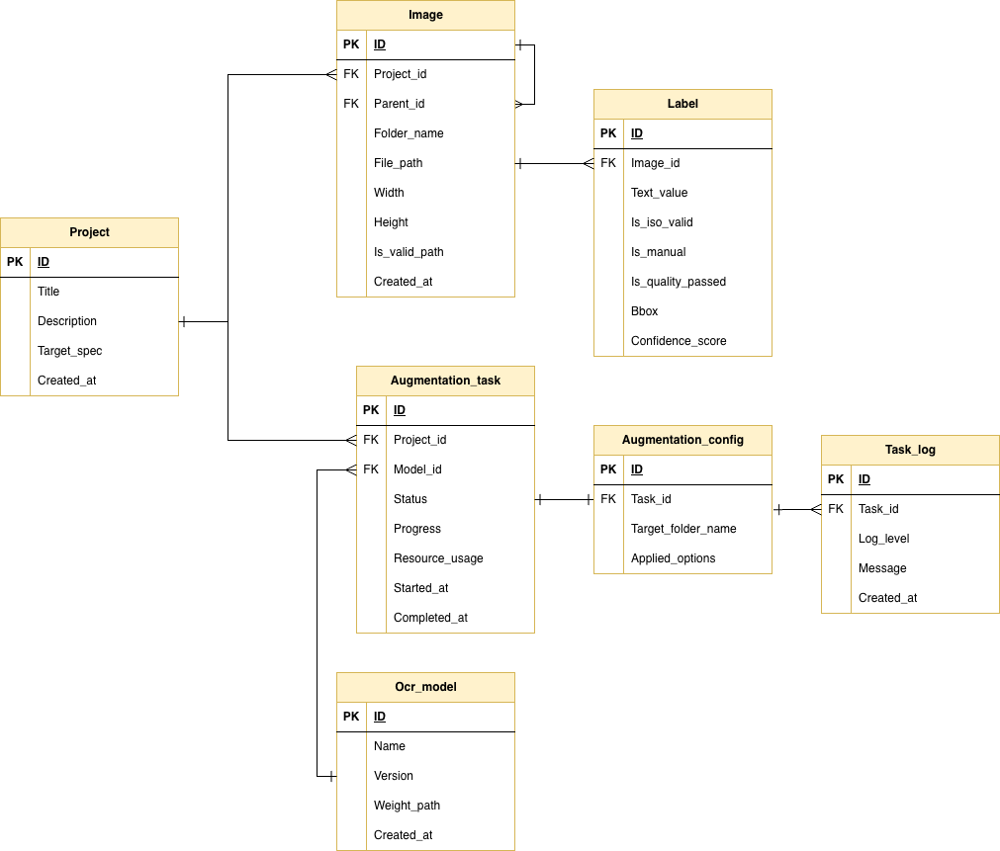

# Container Image Augmentation Framework

## Description

컨테이너 이미지와 레이블(OCR) 쌍 데이터셋이 주어졌을 때, 다양한 증강 기법을 파이프라인으로 적용해 데이터셋 규모를 확장하고, 이를 관리·다운로드할 수 있는 프레임워크.

## 기술 스택

| Layer | Stack |
| --- | --- |
| Frontend | Next.js |
| Backend | FastAPI (Python) |
| Database | PostgreSQL |
| GPU | CUDA 12.6 |
| Infra | Docker Compose |
| API Spec | Swagger |

---

## TO-DO
`완료한 내용의 경우: 해당 내용 관련 링크 추가 → ☑︎ 마크로 수정`
### 4주차 진행사항
- ☑ **기능명세서/ERD 수정** - 셔플 기능 추가 및 ERD 컨벤션 통일 [ERD.png](#erd) by `최규문`, `손원빈`
- ☑ **프로젝트 기본 구성** - monorepo 형태로 프로젝트 구조 구성 by `손원빈`
- ☑ **frontend 기본 레이아웃 구성** - 전체적인 기본 레이아웃 초기 구성 (shadcn 기반) [#1](./docs/screenshots/fe1.png)∙[#2](./docs/screenshots/fe2.png)∙[#3](./docs/screenshots/fe3.png)  by `손원빈`
- ☑ **backend 기본 구성 세팅** - 파이썬 환경/FastAPI/PostGRE 환경 초기 세팅 by `서준일`
- ◻︎ **셔플 기능 구현** - 프레임워크 핵심 기능인 셔플 기능 구현 및 테스트
- ◻︎ **OCR 모델 평가** - 제공된 데이터셋에 대한 OCR 모델 성능 테스트
---
### 1~3주차 진행사항
- ☑ **역할 분담 상세** - 가급적 FE/BE로만 구성 [Roles](#roles)
- ☑︎ **기능명세서 작성** - 테이블 형태로 대분류/요구사항ID/기능명/설명/담당자(FE/BE) 명세 [Google Sheet](https://docs.google.com/spreadsheets/d/17DANYS-GZLFTHw2bwCTlRF6p3NuAGPh8ZYi41EiuVQk/edit?usp=sharing) by `송원호`, `손원빈`
- ☑ **ERD** - Database 설계를 위한 초기 구조 구상 [ERD.png](./docs/ERD_drawio.png) / [ERD spec](./docs/ERD_spec.md) by `서준일`, `최규문`
- ☑︎ **와이어 프레임** - 레이아웃 이해를 위한 와이어 프레임 그리기 [Figma](https://www.figma.com/design/N9IqXOyZk6aalWzqfqqexR/%EC%9D%BC%EA%B2%BD%ED%97%98-%EC%99%80%EC%9D%B4%EC%96%B4%ED%94%84%EB%A0%88%EC%9E%84?node-id=0-1&t=b3LENYVPCfelbv4K-1) by `송원호`
- ☑︎ **시스템 아키텍처 구조도** - 흐름 파악 및 파이프라인 구조 이해를 위한 아키텍처 설계 [Architecture.png](./docs/Architecture.png) by `손원빈`
- ☑︎ **프레임워크 기본 개념 공부** - Next.js (FE) / FastAPI (BE) 기본 구성 요소 및 개념 이해
---
## Architecture

## ERD

---

## Roles
- **송원호** - Frontend
- **손원빈** - Frontend
- **최규문** - Backend
- **서준일** - Backend

---

## Project Guidelines
### Conventional Commits
`type(scope): subject`
- type: 변경 작업 종류
- scope: 영향 범위 (생략 가능)
- subject: 변경 내용 요약 설명
- 예시: `docs: update readme` → "문서(docs) 수정", "readme파일 업데이트"
- 가능하면 구분가능한 수정단위 하나씩 커밋
### Conventional Branch
`type/short-description`
- type: 작업 종류
- short-description: 간략 설명
- 가능하면 하나의 브랜치에서 하나의 기능/모듈 단위 작업